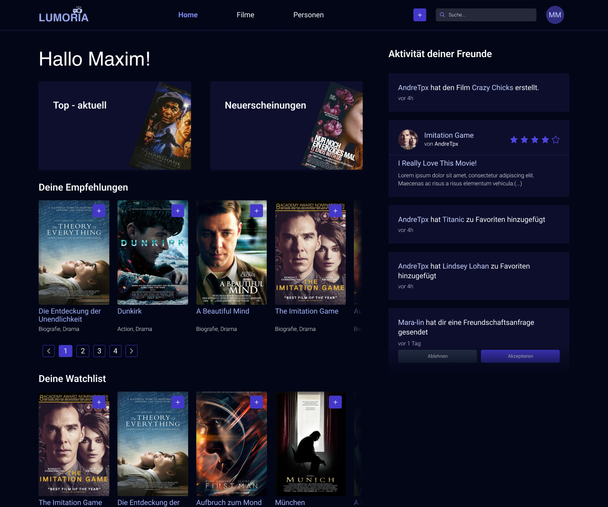
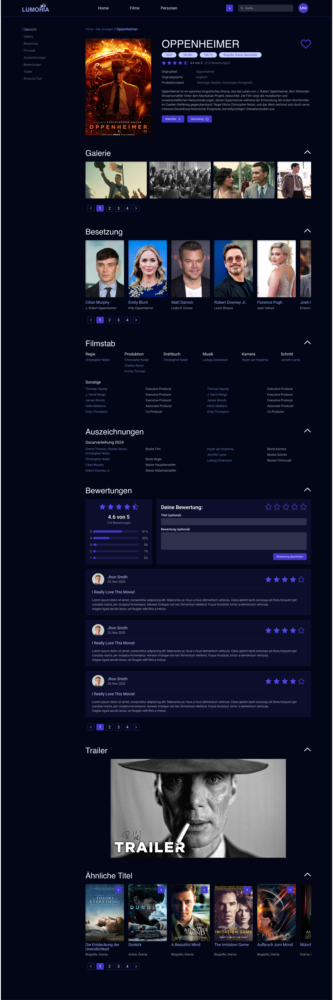
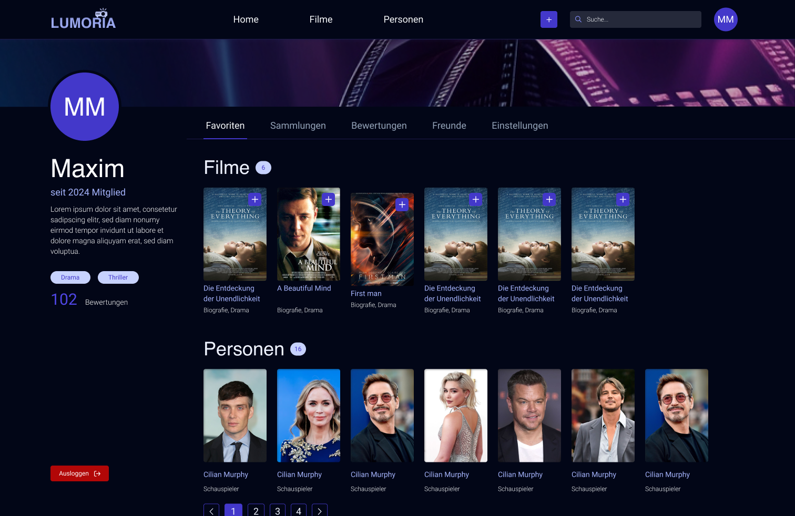

# LUMORIA 🎬

Eine moderne Filmdatenbank-Anwendung gebaut mit Laravel und Livewire.



## Features

###  Filmverwaltung
- Detaillierte Filmseiten mit Galerie, Besetzung und Crew
- Bewertungssystem mit 5-Sterne-Rating
- Trailer-Integration
- Auszeichnungen und Awards-Tracking

###  Benutzerverwaltung
- Benutzerprofile mit Biografie und Lieblings-Genres
- Freundschaftssystem mit Anfragen
- Aktivitäts-Feed für Freundesaktivitäten
- Private und öffentliche Sammlungen

###  Sammlungen & Listen
- Persönliche Film-Sammlungen erstellen
- Watchlist-Funktionalität
- Favoriten-System für Filme und Personen
- Öffentliche/Private Sichtbarkeitseinstellungen

###  Such- & Empfehlungssystem
- Erweiterte Filmsuche
- Personalisierte Empfehlungen basierend auf Lieblings-Genres
- Genre-basierte Filterung

###  Personen & Crew
- Detaillierte Personen-Profile
- Schauspieler- und Crew-Verwaltung
- Filmografie-Anzeige
- Ähnliche Personen-Empfehlungen

## Tech Stack

- **Backend**: Laravel 10+
- **Frontend**: Livewire, Alpine.js
- **Styling**: Tailwind CSS
- **Database**: SQLite/MySQL
- **Storage**: Laravel Storage (für Bilder)

## Installation

```bash
# Repository klonen
git clone <repository-url>
cd lumoria

# Dependencies installieren
composer install
npm install

# Environment Setup
cp .env.example .env
php artisan key:generate

# Database Setup
php artisan migrate --seed

# Assets kompilieren
npm run build

# Server starten
php artisan serve
```

## Hauptkomponenten

### Models
- `User` - Benutzerverwaltung mit Freundschaften
- `Movie` - Filmverwaltung mit Bewertungen
- `Person` - Schauspieler/Crew-Mitglieder
- `UserActivity` - Aktivitäts-Tracking für Social Features
- `Friendship` - Freundschaftssystem
- `Review` - Bewertungen und Rezensionen

### Livewire Components
- `ProfilePage` - Benutzerprofil mit Tabs
- `FriendsActivity` - Aktivitäts-Feed
- `CreateReview` - Bewertungen erstellen/bearbeiten
- `UserProfilePage` - Öffentliche Benutzerprofile

### Key Features
- **UserActivity System**: Automatisches Logging von Benutzeraktivitäten
- **Recommendation Engine**: Genre-basierte Filmempfehlungen
- **Social Features**: Freundschaften, Aktivitäts-Feed, öffentliche Profile
- **Media Management**: Upload und Verwaltung von Postern/Galeriebildern

## Screenshots




Die Anwendung bietet eine moderne, dunkle UI mit:
- Responsive Design für alle Geräte
- Intuitive Navigation zwischen Filmen, Personen und Profil
- Rich Media-Integration mit Trailern und Bildgalerien
- Social Features für Community-Interaktion

## Lizenz

[MIT License](LICENSE)
